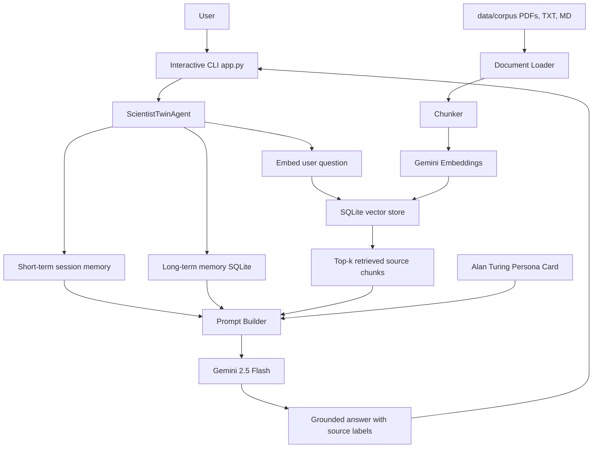

# Architecture Diagram

## Component responsibilities

- `app.py`: user-facing interactive loop.
- `digital_twin/agent.py`: central orchestration.
- `digital_twin/ingest.py`: builds the RAG index.
- `digital_twin/vector_store.py`: stores and retrieves embedded chunks.
- `digital_twin/memory.py`: stores session turns and persistent memories.
- `digital_twin/persona.py`: defines the scientist's speaking and reasoning style.
- `digital_twin/llm.py`: wraps Gemini generation and embeddings.
